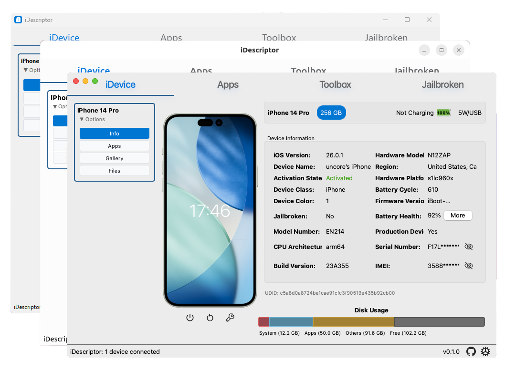
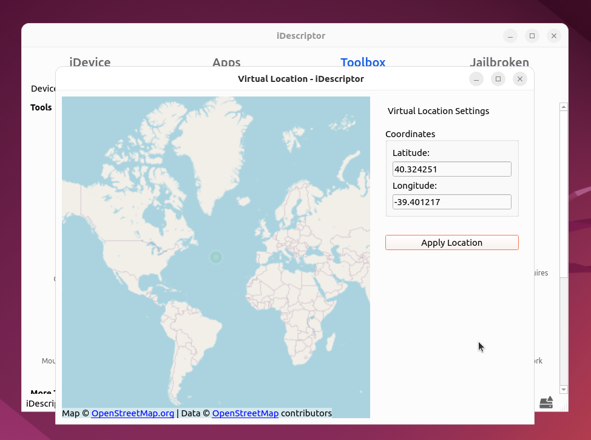
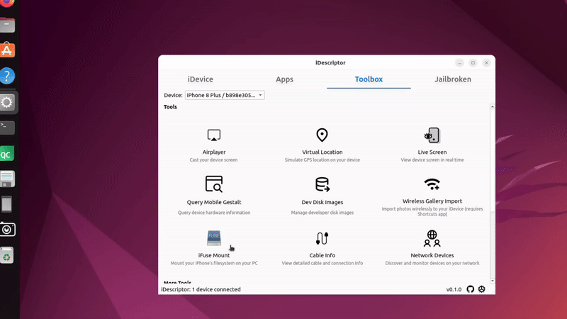
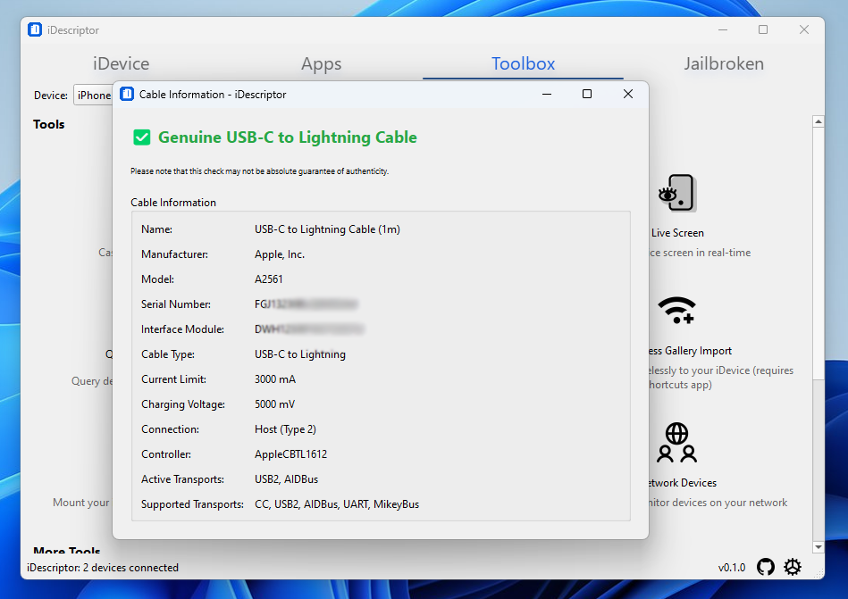
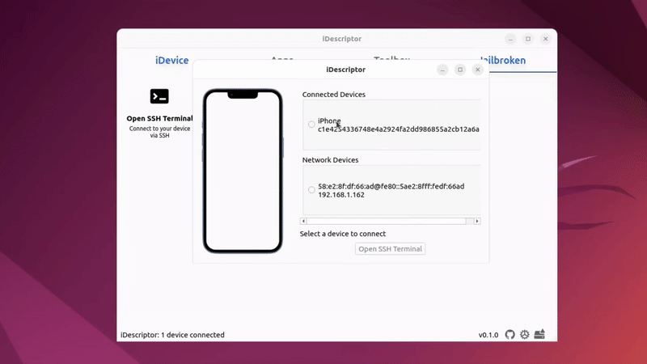

<p align="center" style="text-align: center">
  <br/>
</p>

<p align="center">
    Cross platform, open-source and free idevice management tool written in C++
  <br/>
  <br/>
  <a href="https://github.com/iDescriptor/iDescriptor/blob/master/LICENSE">
    
  </a>
  <a href="https://github.com/iDescriptor/iDescriptor/issues">
    
  </a>
  <a href="https://github.com/iDescriptor/iDescriptor/actions/workflows/build-and-test.yml" rel="nofollow">
    
  </a>
  <a href="https://github.com/iDescriptor/iDescriptor/tags" rel="nofollow">
    
  </a>
  
  
  
  <a href="https://github.com/iDescriptor/iDescriptor/releases">
    
  </a>
  <a href="https://github.com/iDescriptor/iDescriptor/releases">
    
  </a>
  <br/>
  <br/>
   <a href="https://aur.archlinux.org/packages/idescriptor-git/">
    
  </a>
</p>

<p align="center">
    <br/>
</p>

## Features

### Connection

| Feature                     | Status               | Notes                                         |
| --------------------------- | -------------------- | --------------------------------------------- |
| USB Connection              | ✅ Implemented       | Fully supported on Windows, macOS, and Linux. |
| Wireless Connection (Wi‑Fi) | ⚠️ To be implemented | -                                             |

### Tools

| Feature                                                | Status         | Notes                                                                                 |
| ------------------------------------------------------ | -------------- | ------------------------------------------------------------------------------------- |
| [AirPlay](#airplay)                                    | ✅ Implemented | Cast your device screen to your computer.                                             |
| [Download & Install Apps From Apple Store](#app-store) | ✅ Implemented | Download and install apps directly from the Apple Store.                              |
| [Virtual Location](#virtual-location)                  | ✅ Implemented | Simulate GPS location. Requires a mounted Developer Disk Image. **( iOS 6 - iOS 16)** |
| [iFuse Filesystem Mount](#ifuse-filesystem-mount)      | ✅ Implemented | Mount the device's filesystem. (Windows & Linux only)                                 |
| Gallery                                                | ✅ Implemented | -                                                                                     |
| File Explorer                                          | ✅ Implemented | Explore the device's filesystem.                                                      |
| Wireless Gallery Import                                | ✅ Implemented | Import photos wirelessly (requires the Shortcuts app on the iDevice).                 |
| [Cable Info](#cable-info)                              | ✅ Implemented | Check authenticity of connected USB cables and more.                                  |
| [Network Device Discovery](#network-device-discovery)  | ✅ Implemented | Discover and monitor devices on your local network.                                   |
| [SSH Terminal](#ssh-terminal) **(Jailbroken)**         | ✅ Implemented | Open up a terminal on your iDevice.                                                   |
| Query MobileGestalt                                    | ✅ Implemented | Read detailed hardware and software information from the device.                      |
| [Live Screen](#live-screen)                            | ✅ Implemented | View your device's screen in real-time **(wired)**.                                   |
| Developer Disk Images                                  | ✅ Implemented | Manage and mount developer disk images. **( iOS 6 - iOS 16)**                         |

### Device Actions

| Feature             | Status         | Notes |
| ------------------- | -------------- | ----- |
| Restart Device      | ✅ Implemented | -     |
| Shutdown Device     | ✅ Implemented | -     |
| Enter Recovery Mode | ✅ Implemented | -     |

## Fully Theme Aware

<p align="center">
    <br/>
</p>
<p align="center">
    <br/>
</p>

## AirPlay

### Cast your device screen to your computer!

<p align="center">
    <br/>
</p>

## App Store

### Download and Install Apps directly from the Apple Store!

You need to sign in with your Apple ID to use this feature.

<p align="center">
    <br/>
</p>

## Virtual Location

### Simulate GPS location on your iDevice! (iOS 6 - iOS 16)

<p align="center">
    <br/>
</p>

## iFuse Filesystem Mount

### Use your iDevice as a regular DRIVE!

Literally mount your iDevice filesystem and use it as a regular drive , read and write are both allowed. Don't try to import photos or videos because it won't work that way, use the Gallery Import feature for that.

#### Windows

<p align="center">
    <br/>
</p>

#### Ubuntu / Linux

<p align="center">
    <br/>
</p>

### Gallery

<p align="center">
    <br/>
</p>

### File Explorer

<p align="center">
    <br/>
</p>

## Cable Info

<p align="center">
    <br/>
</p>

## Network Device Discovery

<p align="center">
    <br/>
</p>

## SSH Terminal

### Open up a terminal on your Jailbroken iDevice!

<p align="center">
    <br/>
</p>

## Live Screen

Useful if your device does not support AirPlay

<p align="center">
    <br/>
</p>

## **Authentication Required** ?

You might get this pop-up on any platform this is because this app uses secure backends to retrieve and store your Apple credentials. You can disable this in settings but it is not recommended and not safe for your Apple account. Also if you leave this enabled and sign in you can use the same credentials in ipatool without signing in again.

<p align="center">
    <br/>
</p>

## Become a Sponsor

If you like this project and want to support its development, consider becoming a sponsor on [GitHub Sponsors](https://github.com/sponsors/yourusername).

## Thanks

- [libimobiledevice](https://libimobiledevice.org/) - Cross-platform software library that talks the protocols to support iPhone, iPad, iPod Touch devices.
- [ipatool](https://github.com/majd/ipatool) - A command-line tool for managing iOS apps and devices.

## Linux Udev Rules

iDescriptor will check for udev rules but in case it fails, you can manually add the udev rules by doing similar to the following:

```bash
@uncore  sudo cat /etc/udev/rules.d/99-idevice.rules
SUBSYSTEM=="usb", ATTR{idVendor}=="05ac", MODE="0666"

✘  Sun 6 Jul - 14:29  ~ 
@uncore  sudo groupadd idevice

Sun 6 Jul - 14:30  ~ 
@uncore  sudo usermod -aG idevice $USER

Sun 6 Jul - 14:30  ~ 
@uncore  sudo udevadm control --reload-rules
sudo udevadm trigger
```
